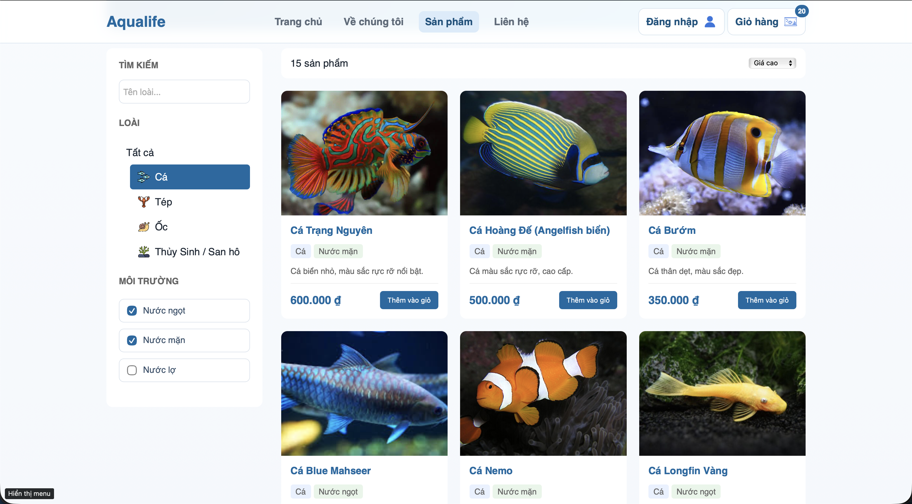

# Aqualife Frontend Project

## Giới thiệu

`Aqualife` là dự án của nhóm 02 lớp NTT1165(225)_02-Thiết kế WEB được xây dựng bằng **HTML, CSS và JavaScript**, mô phỏng một trang web giới thiệu và bán cá cảnh cùng các sinh vật trong đại dương. Dự án tập trung vào việc tổ chức giao diện rõ ràng, hiển thị dữ liệu từ JSON, xử lý tương tác phía người dùng bằng JavaScript và tối ưu trải nghiệm trên nhiều kích thước màn hình.

## Preview

### Hình ảnh minh họa giao diện




## Mục tiêu thực hiện

- Xây dựng website frontend không dùng framework.
- Tách biệt rõ phần giao diện, logic và dữ liệu.
- Render dữ liệu động từ file JSON.
- Tạo các tương tác UI bằng JavaScript thuần.
- Thiết kế responsive bằng CSS để hiển thị tốt trên desktop và mobile.

## Công nghệ sử dụng

- `HTML5`: xây dựng cấu trúc trang.
- `CSS3`: định dạng giao diện, layout và responsive.
- `JavaScript (Vanilla JS)`: xử lý logic, sự kiện và render dữ liệu.
- `JSON`: lưu trữ dữ liệu mock phục vụ hiển thị sản phẩm và nội dung liên quan.

## Cấu trúc thư mục

```text
Web-ban-ca-1/
├── html/       # Các trang HTML chính của website
├── css/        # File CSS giao diện và responsive
├── js/         # File JavaScript xử lý logic và tương tác
├── json/       # Dữ liệu mock JSON
├── video/      # Video sử dụng trong giao diện
├── image/      # Hình ảnh, icon, ảnh sản phẩm
└── index.html  # File điều hướng ban đầu
```

### Ý nghĩa từng thư mục

- `html/`: chứa các trang như trang chủ, sản phẩm, chi tiết sản phẩm, giỏ hàng, đăng nhập, thanh toán, liên hệ, giới thiệu.
- `css/`: chứa các file style riêng cho từng trang và các style dùng chung.
- `js/`: chứa logic xử lý hiển thị sản phẩm, chi tiết sản phẩm, giỏ hàng, đăng nhập, thanh toán và tương tác giao diện.
- `json/`: chứa dữ liệu mock dùng để render nội dung động, đặc biệt là danh sách sản phẩm.
- `video/`: chứa video nền và video minh họa cho website.
- `image/`: chứa hình ảnh thương hiệu, icon và ảnh sản phẩm.

## Chức năng chính

### 1. Render dữ liệu từ JSON

- Dữ liệu sản phẩm được lưu trong thư mục `json/`.
- JavaScript đọc dữ liệu từ file JSON và hiển thị ra giao diện.
- Nội dung được render động thay vì viết cứng toàn bộ trong HTML.

### 2. Tương tác UI bằng JavaScript

- Hiển thị danh sách sản phẩm.
- Lọc và tìm kiếm sản phẩm theo điều kiện.
- Sắp xếp danh sách sản phẩm.
- Xem chi tiết sản phẩm.
- Thêm sản phẩm vào giỏ hàng.
- Cập nhật số lượng giỏ hàng.
- Xử lý các thao tác đăng nhập, đăng ký, thanh toán và điều hướng giữa các trang.

### 3. Responsive CSS

- Giao diện được chia tách CSS theo từng trang để dễ quản lý.
- Có tối ưu hiển thị trên nhiều kích thước màn hình.
- Bố cục, hình ảnh, nút bấm và khu vực nội dung được thiết kế để thích ứng trên desktop và mobile.

## Luồng hoạt động tổng quát

1. Người dùng truy cập vào trang trong thư mục `html/`.
2. JavaScript tải dữ liệu từ thư mục `json/`.
3. Dữ liệu được render lên giao diện dưới dạng danh sách hoặc chi tiết.
4. Người dùng thao tác với giao diện như tìm kiếm, lọc, thêm giỏ hàng, chuyển trang.
5. CSS đảm nhiệm phần trình bày và responsive cho toàn bộ website.

## Các trang tiêu biểu

- `html/home.html`: trang chủ.
- `html/products.html`: danh sách sản phẩm.
- `html/product-detail.html`: chi tiết sản phẩm.
- `html/cart.html`: giỏ hàng.
- `html/auth.html`: đăng nhập.
- `html/register.html`: đăng ký.
- `html/pay.html`: thanh toán.
- `html/about.html`: giới thiệu.
- `html/contact.html`: liên hệ.

## Hướng dẫn sử dụng

Người dùng có thể trải nghiệm website theo luồng cơ bản sau:

1. Truy cập trang `html/home.html` để xem giao diện trang chủ, banner giới thiệu, danh mục và các sản phẩm nổi bật.
2. Từ thanh điều hướng hoặc nút mua hàng, chuyển sang trang `html/products.html` để xem danh sách sản phẩm hiện có.
3. Tại trang sản phẩm, người dùng có thể tìm kiếm theo tên, lọc theo loài, lọc theo môi trường nước và sắp xếp danh sách theo giá.
4. Nhấn vào một sản phẩm bất kỳ để mở trang `html/product-detail.html` và xem thông tin chi tiết.
5. Tại trang chi tiết sản phẩm, chọn số lượng cần mua rồi nhấn `Thêm vào giỏ` để lưu sản phẩm vào giỏ hàng.
6. Mở trang `html/cart.html` để kiểm tra các sản phẩm đã chọn, thay đổi số lượng hoặc xóa sản phẩm nếu cần.
7. Nhấn `Thanh toán` để chuyển sang trang `html/pay.html`.
8. Tại trang thanh toán, nhập thông tin khách hàng, chọn phương thức thanh toán và nhấn `Đặt hàng` để hoàn tất quy trình mô phỏng đặt mua.

Ngoài luồng chính trên, website còn có các trang hỗ trợ khác:

- `html/about.html`: giới thiệu về website.
- `html/contact.html`: thông tin liên hệ và hỗ trợ.
- `html/auth.html`: giao diện đăng nhập.
- `html/register.html`: giao diện đăng ký tài khoản.

## Cách chạy project

### Cách khuyến nghị

Do project có sử dụng `fetch()` để đọc dữ liệu JSON, nên cần chạy bằng **local server** để tránh lỗi khi mở trực tiếp bằng đường dẫn file.

Có thể dùng một trong các cách sau:

- `Live Server` trong VS Code.
- `Python HTTP Server`.
- Bất kỳ local server tĩnh nào khác.

Ví dụ với Python:

```bash
python3 -m http.server 5500
```

Sau đó truy cập:

```text
http://localhost:5500/html/home.html
```

## Điểm nổi bật của project

- Tổ chức thư mục rõ ràng, tách biệt giữa HTML, CSS, JS, JSON, image và video.
- Áp dụng JavaScript thuần để render dữ liệu động.
- Dễ mở rộng thêm sản phẩm hoặc nội dung chỉ bằng cách cập nhật file JSON.
- Có tính thực tiễn trong việc xây dựng giao diện bán hàng cơ bản.
- Phù hợp để minh họa quy trình phát triển một dự án frontend không dùng framework.

## Hướng phát triển thêm

- Kết nối dữ liệu thật từ API/backend.
- Bổ sung xác thực người dùng hoàn chỉnh.
- Lưu giỏ hàng và đơn hàng bằng cơ sở dữ liệu.
- Tối ưu SEO và hiệu năng tải trang.
- Chuẩn hóa kiểm tra dữ liệu đầu vào ở các form.

## Thành viên nhóm

| Thành viên | Vai trò và công việc thực hiện |
| --- | --- |
| Nguyễn Minh Hiếu | Xử lí footer và các trang `Trang chủ`, `Về chúng tôi`, `Sản phẩm`, `Chi tiết sản phẩm`; thêm ảnh, video cho website; thêm dữ liệu sản phẩm; xử lí bug. |
| Nguyễn Văn Hiếu | Test web và phản hồi bug cho Nguyễn Minh Hiếu và Dương Tiến Hào; làm báo cáo; thiết kế bài thuyết trình. |
| Hà Văn Hiếu | Lên ý tưởng và thiết kế giao diện ban đầu cho website; phản hồi về UX; hỗ trợ Nguyễn Văn Hiếu làm bài thuyết trình; tham gia thuyết trình. |
| Dương Tiến Hào | Xử lí header và các trang `Liên hệ`, `Đăng nhập/Đăng kí`, `Giỏ hàng`, `Đặt hàng`; thiết kế con trỏ riêng cho web; thiết kế logo cho web; deploy web lên GitHub Pages; hỗ trợ Nguyễn Minh Hiếu thêm ảnh, video; xử lí bug. |

## Kết luận

Project `Aqualife` đáp ứng tốt mục tiêu của một bài tập lớn môn Thiết kế Web: có cấu trúc rõ ràng, có dữ liệu mock, có render động bằng JavaScript, có xử lý tương tác UI và có responsive CSS. Đây là nền tảng phù hợp để tiếp tục phát triển thành một website hoàn chỉnh hơn trong các giai đoạn tiếp theo.
